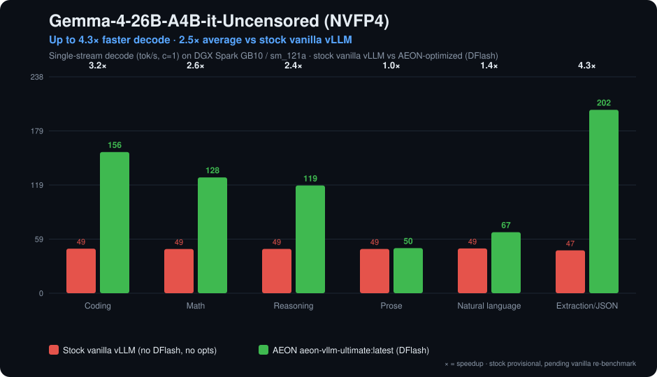
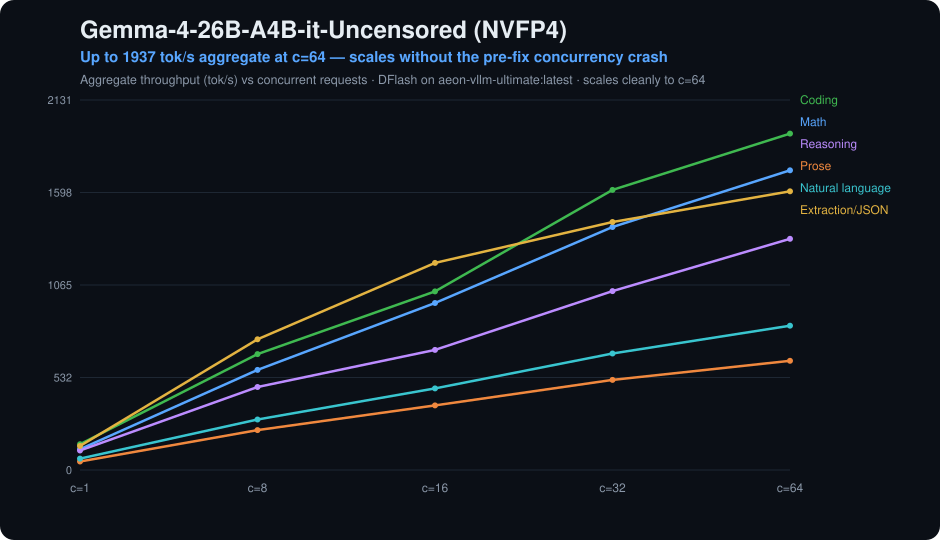

[](#support-the-work)

## Quick Links

| Resource | Link |
|---|---|
| **Model Weights + Full Documentation** | [AEON-7/Gemma-4-26B-A4B-it-Uncensored-NVFP4 on HuggingFace](https://huggingface.co/AEON-7/Gemma-4-26B-A4B-it-Uncensored-NVFP4) |
| **DFlash vLLM Container (DGX Spark)** | [`ghcr.io/aeon-7/aeon-vllm-ultimate:latest`](https://github.com/AEON-7/vllm-ultimate-dgx-spark) |
| **DFlash Drafter** | [z-lab/gemma-4-26B-A4B-it-DFlash](https://huggingface.co/z-lab/gemma-4-26B-A4B-it-DFlash) |

## Quick Start

Complete copy-paste recipe — pull the container, pull the model (fresh), pull the DFlash drafter (fresh), then serve with the vetted DGX Spark recipe (DFlash n=10, drafter `flash_attn`, body `triton_attn`). The recipe notes below cover tag-specific drafter backends and the production GPU-util / context-tier profile; see also [Container Image Details](#container-image-details).

```bash
# 1. Pull the AEON vLLM Ultimate image (vLLM 0.23.0 sm_121a from-source + PR#44389 NVFP4-KV +
#    PR#40898/#41703 DFlash drafter fixes + DFlash high-concurrency fix).
#    :latest = :2026-06-18-v0.23.0-dflashfix; rollback :2026-06-11-pr41703.
docker pull ghcr.io/aeon-7/aeon-vllm-ultimate:latest

# 2. Download the target model (fresh).
huggingface-cli download AEON-7/Gemma-4-26B-A4B-it-Uncensored-NVFP4 \
  --local-dir ./models/gemma4

# 3. Download the DFlash drafter (fresh — pull the latest z-lab build).
huggingface-cli download z-lab/gemma-4-26B-A4B-it-DFlash \
  --local-dir ./models/gemma4-dflash

# 4. Serve — recipe for :latest (2026-06-11+): DFlash n=10, drafter flash_attn, body triton_attn.
#    (The image ENTRYPOINT is bash, so override it with --entrypoint vllm.)
docker run --gpus all --ipc host --network host \
  -e VLLM_ALLOW_LONG_MAX_MODEL_LEN=1 \
  -e TORCH_MATMUL_PRECISION=high \
  -e PYTORCH_CUDA_ALLOC_CONF=expandable_segments:True \
  -e VLLM_USE_FLASHINFER_MOE_FP4=0 \
  -e VLLM_TEST_FORCE_FP8_MARLIN=0 \
  -e VLLM_NVFP4_GEMM_BACKEND=flashinfer-cutlass \
  -e VLLM_USE_FLASHINFER_SAMPLER=1 \
  -v "$PWD/models/gemma4:/models/gemma4:ro" \
  -v "$PWD/models/gemma4-dflash:/models/gemma4-dflash:ro" \
  --entrypoint vllm \
  ghcr.io/aeon-7/aeon-vllm-ultimate:latest \
  serve /models/gemma4 \
    --served-model-name gemma4-aeon-uncensored gemma4-fast gemma4-deep \
    --host 0.0.0.0 \
    --port 8000 \
    --tensor-parallel-size 1 \
    --dtype auto \
    --quantization compressed-tensors \
    --attention-backend triton_attn \
    --max-model-len 262144 \
    --max-num-seqs 64 \
    --max-num-batched-tokens 32768 \
    --gpu-memory-utilization 0.80 \
    --enable-chunked-prefill \
    --enable-prefix-caching \
    --trust-remote-code \
    --enable-auto-tool-choice \
    --tool-call-parser gemma4 \
    --reasoning-parser gemma4 \
    --speculative-config '{"method":"dflash","model":"/models/gemma4-dflash","num_speculative_tokens":10,"attention_backend":"flash_attn"}'
```

**Recipe notes — the drafter backend is tied to the image tag:**
- **On `:latest` / `:2026-06-18-v0.23.0-dflashfix` (current; same behavior as the `:2026-06-11-pr41703` fix lineage):** the drafter **must** use `attention_backend: flash_attn` (enabled for multimodal Gemma targets by PR #41703's `use_mm_prefix=False`). `flex_attention` **crashes at the first request** on this image (non-contiguous KV view in the new KV-sharing path). `--enable-prefix-caching` is safe and recommended — soak-validated with DFlash (see the fixes section below).
- **On the rollback tag `:2026-06-04-pr44389` (pre-fix):** the reverse — only `flex_attention` loads (`flash_attn` fails with `partial multimodal token full attention not supported`), the drafter silently runs without sliding-window support (~0% acceptance beyond 2k-token contexts), and `--enable-prefix-caching` triggers a slow acceptance collapse (see below). Not recommended.
- Either way the body stays on `triton_attn` (Gemma's heterogeneous head dims), and do **not** set `--kv-cache-dtype fp8` — DFlash's non-causal drafter requires BF16 KV. `--reasoning-parser gemma4` cleanly splits `enable_thinking` output into `reasoning_content`. `num_speculative_tokens=10` is the value our production fleet runs; the drafter's trained block size is 16 and z-lab ships 15 — an n=10-vs-15 re-bench on the fixed drafter is pending (the earlier "10 beats 15" result was measured on the pre-fix drafter and shouldn't be treated as settled). The model's `config.json` already ships the vision ignore-list fix (`re:.*embed_vision.*`, `re:.*vision_tower.*`) so vLLM keeps the vision tower BF16.

This default profile suits agentic gateways — one large full-context chat plus many short-lived subagents under the `--max-num-seqs 64` cap. For short-context throughput benchmarking, use `--max-model-len 32768 --max-num-seqs 256`.

## Performance — DGX Spark: stock vanilla vs maximally optimized (v0.23.0)

**This is the headline.** On DGX Spark / GB10 the AEON DFlash container turns the default "it runs, but it's slow" stock baseline into a usable long-context local agent model — and the v0.23.0 build now scales cleanly to 64 concurrent requests where the prior image crashed under concurrent speculative decoding.

<p align="center"></p>
<p align="center"></p>

Measured on the current production image **`ghcr.io/aeon-7/aeon-vllm-ultimate:latest`** (vLLM 0.23.0 sm_121a from-source build + DFlash `num_speculative_tokens: 10`, drafter `flash_attn`, body `triton_attn`), single-stream (c=1), by category:

| Category | 🟢 Decode tok/s | TTFT p50 | TPOT p50 | Prefill (PP) | DFlash accept | vs stock |
|---|---:|---:|---:|---:|---:|---:|
| Coding | **155.8** | 83 ms | 6.4 ms | 601 tok/s | 58.9% | **3.2×** |
| Math | **127.8** | 145 ms | 7.8 ms | 420 tok/s | 48.7% | **2.6×** |
| Reasoning | **118.9** | 105 ms | 8.4 ms | 439 tok/s | 43.9% | **2.4×** |
| Prose | **49.8** | 105 ms | 20.1 ms | 324 tok/s | 11.1% | 1.0× |
| Natural language | **67.3** | 97 ms | 14.9 ms | 393 tok/s | 20.0% | **1.4×** |
| Extraction / JSON | **202.4** | 85 ms | 4.9 ms | 602 tok/s | 77.5% | **4.3×** |

vs a **stock vanilla `vllm/vllm-openai` 0.20.1 baseline of ~47–49 tok/s** (no DFlash, no sm_121a optimizations) → **up to 4.3× faster decode (≈2.5× average)**, and it now scales cleanly to **c=64 concurrent** (1,937 tok/s aggregate on coding) with no crash. See [What we fixed for the DGX Spark](#what-we-fixed-for-the-dgx-spark).

> **Stock baseline note:** the stock/un-optimized figures are vanilla vLLM (`vllm/vllm-openai` 0.20.1, no DFlash, no AEON/sm_121a optimizations) and are **provisional — to be refreshed** with a fresh fully-vanilla re-benchmark on the current version. The optimized figures are measured on the current `aeon-vllm-ultimate:latest` (vLLM 0.23.0) build. (The full stock sweep with provenance is preserved [below](#stock-community-vllm-baseline-no-dflash).)

### Long-context tiers (current build)

DFlash acceptance holds as context grows — the DFlash sliding-window-attention fix (PR #40898) keeps the drafter useful well past 2k tokens. Single-stream (c=1), measured `prompt_tokens_p50` as the context size:

| Context | Category | Decode tok/s | TTFT p50 | Prefill (PP) | DFlash accept |
|---|---|---:|---:|---:|---:|
| ~16k | Coding | 128.2 | 3.8 s | 4,270 tok/s | 58.7% |
| ~16k | Reasoning | 102.8 | 5.2 s | 3,915 tok/s | 46.4% |
| ~16k | Extraction / JSON | 169.8 | 5.2 s | 3,890 tok/s | 77.5% |
| ~32k | Coding | 92.8 | 10.2 s | 3,188 tok/s | 46.7% |
| ~32k | Reasoning | 83.0 | 14.1 s | 2,899 tok/s | 40.8% |
| ~32k | Extraction / JSON | 156.3 | 14.1 s | 2,888 tok/s | 77.5% |

## Model Specs

| Property | Value |
|---|---|
| Architecture | Gemma 4 Mixture of Experts |
| Total / Active Parameters | 26B / ~4B per token (top-8 of 128 experts) |
| Layers | 30 (25 sliding-window + 5 full-attention) |
| Max Context | 262,144 tokens |
| Quantization | NVFP4 (compressed-tensors) |
| Model Size on Disk | 15.3 GB |
| VRAM Loaded | 16.25 GB |
| Vision | 27-layer ViT (BF16) |
| Tool Calling | Native Gemma 4 format |

## 2026-06-11 — DFlash drafter fixes (vLLM PR #40898 + #41703)

All previously published DFlash numbers for this model were measured on a **defective drafter path**. We root-caused three vLLM-side defects in production and merged the upstream fixes (both PRs still open upstream) into [`aeon-vllm-ultimate:latest`](https://github.com/AEON-7/vllm-ultimate-dgx-spark):

| Defect (pre-fix images) | Symptom | Fixed by |
|---|---|---|
| Rejected-token context-KV writes corrupted the drafter's paged KV cache; `--enable-prefix-caching` made the corruption persistent and self-accelerating | Draft acceptance decayed 34–56% → **0.0%** over minutes-to-hours of traffic → ~6× decode slowdown (144 → 24 tok/s), healed only by restart | [#41703](https://github.com/vllm-project/vllm/pull/41703) masks rejected/invalid context slots |
| The z-lab drafter is 4-of-5-layers **sliding-window-2048**, but ran as full attention | Any request with >2k tokens of context got **~0% acceptance** (long chats, agent histories, big system prompts) | [#40898](https://github.com/vllm-project/vllm/pull/40898) adds DFlash SWA support |
| Missing Gemma-4 sqrt(hidden) embed normalizer + final-logit softcap in the draft path | Depressed acceptance ceiling — mean acceptance length 4.4–6.6 vs z-lab's published 6.1–8.6 | [#41703](https://github.com/vllm-project/vllm/pull/41703) |

**Validated results on the fixed image** (production profile: `--gpu-memory-utilization 0.68 --max-model-len 184320 --max-num-seqs 32 --enable-prefix-caching`, drafter `flash_attn`, n=10):

| Gate | pre-fix | `2026-06-11-pr41703` |
|---|---|---|
| Long-context (~9k system prompt) draft acceptance | ~0–7% | **43.3% / MAL 5.3** |
| Prefix-caching ON + fleet-burst + 10-min production soak | collapse to 0% in ~25 min | **52.0% / MAL 6.20** — improves under load |
| Single-stream coding (c=1, greedy) | 144 tok/s fresh-boot, decaying to ~24 | **149–150 tok/s, sustained** |
| Long-context (~9k) throughput | ~46 tok/s (APC unusable) | **78 tok/s** (APC accelerates the cached prefix) |
| Live production probe (30-persona voice fleet) | — | **60% acceptance / MAL 7.0** |

KV at this profile: 726k tokens / 3.94× concurrency at 180k ctx. Mean acceptance length now lands in z-lab's published range for the first time. A full per-category concurrency re-sweep on the fixed image is pending; the section below is the historical pre-fix sweep.

## Performance — historical short-context sweep (pre-fix image, 2026-06-09)

> ⚠️ Measured on the **pre-fix** image (`:2026-06-04-pr44389`) with the flex-drafter recipe that **crashes on the current `:latest`** — and with the broken drafter (no SWA, no embed normalizer), short-context prompts only. Kept as an honest historical floor; the fixed image measures higher (see above). Long-context performance on this image was far worse than the table suggests (~0% acceptance beyond 2k-token contexts).

Per-category single-stream + concurrency sweep (c=1…128, fresh server per category, 0 request errors), DFlash n=10, BF16 KV:

| Category | c=1 tok/s | Peak aggregate tok/s | vs prior DFlash v2 (n=15) |
|---|---:|---:|---|
| Coding | **144.2** | **1,724 @ c=128** | +53% c1 / +51% peak |
| Math | **99.6** | **1,335 @ c=128** | +35% / +34% |
| Reasoning | **73.6** | **1,087 @ c=128** | +21% / +24% |
| Extraction / JSON | **158.4** | 1,315 @ c=32 | +2% c1 |
| Natural language | 53.8 | 684 @ c=128 | +5% peak |
| Prose | 36.5 | 486 @ c=128 | — |

This pre-fix sweep showed `n=10` beating z-lab's default 15 by 20–50% on the reasoning-heavy categories — but both arms ran the broken drafter, so treat the n=10-vs-15 conclusion as **unsettled** pending the re-bench on the fixed image (drafter block size is 16).

**For maximum many-request aggregate throughput** (very high concurrency, c≥128), serving **without** the drafter measured best on the pre-fix image (~3,000–3,700 tok/s at c=256 via the stock path below). Note the "drafter destabilizes at c=256" behavior observed then is plausibly the now-fixed KV-corruption defect — the high-concurrency crossover needs re-measuring on the fixed image before treating it as current guidance.

## Stock Community vLLM Baseline (No DFlash)

Benchmarked with the official community image `vllm/vllm-openai:latest` pulled on 2026-05-06 (`vLLM 0.20.1`, PyTorch `2.11.0+cu130`, transformers `5.7.0`, image digest `sha256:9eff9734a30b6713a8566217d36f8277630fd2d31cec7f0a0292835901a23aa4`). This run used the same model weights, 32K context, `--max-num-batched-tokens 32768`, and `--max-num-seqs 256`, but no DFlash drafter and no AEON container env overrides. Upstream vLLM now boots this model on GB10 with FlashInfer CUTLASS NVFP4 linear kernels and VLLM CUTLASS MoE.

Full sweep: 6 natural prompt categories x 8 concurrency levels (`1, 4, 8, 16, 32, 64, 128, 256`) = 48 benchmark points, **0 request errors**.

| Category | c=1 tok/s | c=1 TTFT p50 | Peak aggregate tok/s | c=256 aggregate tok/s | c=256 TTFT p50 |
|---|---:|---:|---:|---:|---:|
| Coding | 49.12 | 130.7 ms | 3,356.61 @ c=256 | 3,356.61 | 542 ms |
| Math | 48.79 | 134.0 ms | 3,006.60 @ c=256 | 3,006.60 | 1,078 ms |
| Reasoning | 48.90 | 113.8 ms | 3,241.42 @ c=256 | 3,241.42 | 274 ms |
| Prose | 48.86 | 115.9 ms | 3,222.85 @ c=256 | 3,222.85 | 662 ms |
| Natural language | 49.38 | 72.4 ms | 3,418.94 @ c=256 | 3,418.94 | 650 ms |
| Extraction / JSON | 47.34 | 120.6 ms | 3,674.70 @ c=256 | 3,674.70 | 385 ms |

Use the stock community path when raw many-request aggregate throughput matters more than speculative single-stream speed. Use the DFlash image when you want the lower interactive TPOT and the integrated Gemma 4 DFlash serving recipe.

---

## Why This Is Hard: Gemma 4 on DGX Spark

Running Gemma 4 NVFP4 on a DGX Spark used to require a source-built stack. As of the 2026-05-06 community `vllm/vllm-openai:latest` image, upstream vLLM can boot this model on GB10, and AEON's [`aeon-vllm-ultimate`](https://github.com/AEON-7/vllm-ultimate-dgx-spark) image packages the optimized (and now corrected — see the fixes section above) DFlash path as a single pull-and-run container. Every layer of the stack, from the silicon to the serving framework to the model weights themselves, has had compatibility gaps worth understanding.

### The DGX Spark Problem

The NVIDIA DGX Spark ships with a **GB10 Grace Blackwell** chip: SM 12.1 on ARM64 (aarch64). This is bleeding-edge silicon that much of the ML ecosystem is still catching up to:

- **Python wheels remain risky on SM 12.1.** Official PyPI releases have historically targeted SM 8.0/8.9/9.0 (Ampere/Ada/Hopper). Installing `pip install vllm` can give you CUDA kernels compiled for the wrong GPU; use a tested Docker image or build from source.
- **No pre-built FlashInfer wheels** for SM 12.1. FlashInfer provides the fused MoE dispatch kernels that make expert routing fast. Without it compiled for your architecture, MoE models can't use the optimized CUTLASS/Triton backends.
- **ARM64 architecture** means many x86-only prebuilt binaries don't run at all. Even when packages claim CUDA support, the host-side code is often x86-compiled.
- **273 GB/s memory bandwidth**: fast for a desktop-class device, but a fraction of what data center GPUs offer (H100: 3.35 TB/s, A100: 2 TB/s). This makes model architecture choice critical: dense models that need to read all parameters every token are bandwidth-starved here.

The practical result: current stock vLLM can serve this model, but high-confidence production recipes still need to pin image versions, model format, attention backend, KV dtype, and concurrency settings instead of assuming any vLLM tag will behave the same way.

### The Gemma 4 Problem

Gemma 4 is not just a new model. It is architecturally unusual in ways that break assumptions in existing tooling:

**1. Requires transformers v5+ (nothing else does yet)**

Gemma 4 was the first major model to require the `transformers` v5 major version bump. Older stock vLLM images shipped with v4.x and failed to parse the Gemma 4 config. Current community images may include transformers v5, but pin the version because v4/v5 API differences can still break model loading.

**2. Heterogeneous attention head dimensions**

Most models have uniform head dimensions across all layers. Gemma 4 has `head_dim=256` for sliding-window layers and `global_head_dim=512` for full-attention layers. This breaks attention backends that assume a single head dimension. vLLM forces the `TRITON_ATTN` backend specifically for Gemma 4 to handle this — other backends (FlashAttention, FlashInfer attention) produce numerical divergence or crash.

**3. Hybrid sliding-window + full-attention layers**

Of the 30 layers, 25 use a sliding window of 1024 tokens and 5 use full global attention; all 30 carry MoE blocks (128 experts, top-8 — checkpoint-verified: router + expert tensors in every layer). The two attention types have different compute patterns and KV cache requirements — interleaved through the stack.

**4. Massive MoE expert count**

128 experts per layer with top-8 routing across all 30 layers. That's 128 x 30 = 3,840 expert weight blocks, each with 4 NVFP4 tensors (weight_packed, weight_scale, weight_global_scale, input_global_scale). The total tensor count in this model is **47,648**. Loading and routing these correctly requires FusedMoE kernels that can handle the stacked expert format, and the compressed-tensors naming convention doesn't match what vLLM expects (see below).

### The NVFP4 Quantization Problem

NVFP4 (NVIDIA 4-bit floating point — E2M1 elements with block scales) is how we get a 26B-parameter model into 15.3 GB. But there are two completely different NVFP4 formats in the ecosystem, and they are not compatible:

**ModelOpt NVFP4** (NVIDIA's TensorRT-LLM toolchain): Stores weights as `weight`, `weight_scale_inverse`, `input_scale`. This is what NVIDIA's own tools produce and what most vLLM NVFP4 code paths expect.

**Compressed-tensors NVFP4** (llmcompressor/vLLM community): Stores weights as `weight_packed`, `weight_scale`, `weight_global_scale`, `input_global_scale`. Different tensor names, different scale conventions, different packing format.

This model uses compressed-tensors format (quantized with llmcompressor on an H200). vLLM's Gemma 4 weight loader has hard-coded assumptions about tensor naming that don't match. Specifically:

- **Expert path mismatch**: Compressed-tensors names MoE experts as `layers.X.experts.{id}.{proj}.weight_packed`. vLLM's FusedMoE expects `layers.X.moe.experts.{id}.{proj}.weight_packed` — note the `.moe.` segment. Without patching, every single expert tensor fails to load with a KeyError.
- **Suffix format mismatch**: The weight loader constructs names like `w2_weight.weight_packed` when it should be `w2_weight_packed`. The `_weight.` needs to be collapsed to `_`.
- **Dimension assertion failure**: The original code asserts `dim == 2` for weight tensors, but NVFP4 packed tensors have different dimensionality due to the 4-bit packing.

The included `gemma4_patched.py` fixes all three issues with targeted patches to the weight loading pipeline.

### The Accidental Quantization Problem

When quantizing with llmcompressor, you specify ignore patterns for layers that should stay in BF16 (full precision). The original quantization used patterns like `re:.*visual.*` and `re:.*gate.*` to skip vision and routing layers. But Gemma 4's naming conventions didn't match:

| Layer | Expected Pattern | Actual Name in Gemma 4 | Result |
|---|---|---|---|
| Vision tower | `re:.*visual.*` | `model.vision_tower.*` | **Quantized** (wrong) |
| Vision embedding | `re:.*visual.*` | `model.embed_vision.*` | **Quantized** (wrong) |
| MoE routers | `re:.*gate.*` | `model.*.router.proj.*` | **Quantized** (wrong) |

Quantizing these layers breaks the model:
- **Vision tower** in NVFP4 crashes because vLLM allocates standard `Linear` layers (expects `.weight` tensor, gets `weight_packed`/`weight_scale`/etc.)
- **MoE routers** in NVFP4 corrupts expert routing — the router decides which experts to activate for each token, and 4-bit precision on routing logits causes degenerate expert selection
- **Vision embedding projection** bridges the ViT output to the language model — quantization here cascades errors through every subsequent layer

We fixed this by extracting the original BF16 weights from the base model ([TrevorJS/gemma-4-26B-A4B-it-uncensored](https://huggingface.co/TrevorJS/gemma-4-26B-A4B-it-uncensored)) and replacing the incorrectly quantized tensors in the safetensors file:
- **760 NVFP4 tensors removed** from the vision tower, replaced with **190 original BF16 weights** (355 total vision tensors including biases and layernorms)
- **120 NVFP4 tensors removed** from router.proj layers, replaced with **30 BF16 weights**
- **4 NVFP4 tensors removed** from embed_vision, replaced with **1 BF16 weight**

### The Token Leakage Problem

Gemma 4 uses internal control tokens for multi-channel generation (thinking, tool calls, output). These tokens have specific IDs in the vocabulary:

| Token ID | Token | Purpose |
|---:|---|---|
| 100 | `<\|channel>` | Start internal channel (e.g., thinking) |
| 101 | `<channel\|>` | End internal channel |
| 98 | `<\|think\|>` | Enter thinking mode |
| 48 | `<\|tool_call>` | Start tool call |
| 49 | `<tool_call\|>` | End tool call |

Without proper EOS configuration, the model can enter its "thinking" channel mid-generation, and those internal tokens stream through as plaintext in the API response. Worse, it can get stuck in a repetition loop — endlessly generating `<|channel>thought<channel|>call:process{...}` as visible text. This manifests as the model appearing to "spam" garbage in the chat.

The fix is adding tokens 98, 100, and 101 to the `eos_token_id` list in `generation_config.json`, so vLLM terminates generation cleanly before any internal channel tokens leak into the output.

### What's In The Container (The Special Sauce)

The current image is [`ghcr.io/aeon-7/aeon-vllm-ultimate:latest`](https://github.com/AEON-7/vllm-ultimate-dgx-spark) (= `:2026-06-18-v0.23.0-dflashfix`). Users pull one image; no local patching or source build is required.

| Component | What It Is | Why It Matters |
|---|---|---|
| **vLLM 0.23.0 (sm_121a from-source) + PR #44389** | v0.23.0 built for GB10 + Triton NVFP4 KV cache | Up to 3× KV capacity opt-in (`--kv-cache-dtype nvfp4`; causal speculators only). |
| **PR #40898 + #41703 overlay** | DFlash drafter fixes merged ahead of upstream | Rejected-slot KV-write masking (no more acceptance collapse under prefix caching), drafter sliding-window support, Gemma-4 embed normalizer + logit softcap, `flash_attn` drafter on multimodal Gemma targets. |
| **AEON sm_121a patches** | 3 idempotent runtime patches | GB10 correctness (optional-import lazy binding, hybrid block-size None guards, CUDA-graph capture-size alignment for spec decode). |
| **PyTorch 2.11.0 + CUDA 13** | Framework + runtime | SM 12.1 (GB10) support. |
| **transformers 5.10 dev** | Model config/tokenizer loading | Recognizes `gemma4_unified` and other bleeding-edge classes. |
| **DFlash drafter** | `z-lab/gemma-4-26B-A4B-it-DFlash` (mount separately) | 5-layer SWA-2048 block-diffusion drafter — now actually run with sliding windows. |
| **Native FP4 CUTLASS kernels** | FlashInfer CUTLASS for linear layers, VLLM CUTLASS for MoE | Do not force Marlin on this image; the native FP4 path is faster on GB10. |
| **TRITON_ATTN body / FLASH_ATTN drafter** | Attention computation | Triton handles Gemma 4's heterogeneous head dims (256/512); the drafter's non-causal attention runs on FlashAttention (required on this image). |
| **torch.compile + CUDA graphs** | Graph capture and kernel fusion | Captures decode graphs for the configured batch sizes, reducing Python overhead on the decode hot path. |

### Why MoE Makes This Possible

The fundamental constraint on DGX Spark is memory bandwidth: **273 GB/s**. During autoregressive decode, the GPU must read the model weights for every single token generated. This is what determines tok/s:

```
tok/s = memory_bandwidth / bytes_read_per_token
```

For a **dense 27B model at NVFP4** (~13.5 GB weights):
```
273 GB/s / 13.5 GB = ~20 tok/s (theoretical max, before KV cache and overhead)
```

For this **MoE model** (top-8 of 128 experts, ~2.8 GB active per token):
```
273 GB/s / 2.8 GB = ~97 tok/s (theoretical max)
```

We achieve **~37–158 tok/s single-stream** depending on category — coding sustains 149–150 tok/s measured on the fixed image; prose ~37 and extraction/JSON ~158 from the pre-fix short-context sweep (a floor; fixed-image re-sweep pending) — with aggregate throughput passing 1,700 tok/s on coding (pre-fix sweep) and ~3,700 tok/s on extraction via the stock no-drafter path. The gap from the theoretical limit comes from KV cache reads, attention computation, router overhead, drafter verification, and memory access patterns. But the key insight is that MoE turns a bandwidth-impossible problem (dense 27B) into a bandwidth-comfortable one.

| Model Type | Params Read/Token | Max tok/s on GB10 | Practical tok/s |
|---|---|---|---|
| Dense 27B BF16 | ~54 GB | 5 | Not viable |
| Dense 27B NVFP4 | ~13.5 GB | 20 | ~15 |
| **MoE 26B top-8/128 NVFP4 + DFlash** | **~2.8 GB + drafter** | **97** | **149–150 coding (fixed image); ~54 natural chat / ~158 extraction (pre-fix sweep); 1.7K+ aggregate** |

This is why architecture choice matters more than raw parameter count on bandwidth-limited hardware. A 26B MoE model at NVFP4 is faster than a dense 7B at BF16 on the same hardware.

## What we fixed for the DGX Spark

All AEON models run on one unified container — **`ghcr.io/aeon-7/aeon-vllm-ultimate:latest`** (= `:2026-06-18-v0.23.0-dflashfix`; rollback `:2026-06-11-pr41703`) — vLLM v0.23.0 built from source for GB10 / sm_121a and merged with the AEON speculative-decoding stack.

| Fix | What it does | Why it matters on GB10 |
|---|---|---|
| **DFlash high-concurrency fix** *(new)* | Slices the speculative drafter's KV block-table to the unpadded batch (`block_table[:num_reqs]`) | The drafter previously **crashed at ≥32 concurrent requests** (padded-vs-unpadded block-table shape mismatch in FlashAttention). Now scales cleanly to **c=64**. A port of upstream PR #43982 (fixed for MTP, never applied to DFlash) — present and unfixed even in the prior image. |
| **Triton NVFP4 KV cache** (PR #44389) | Software NVFP4 KV-cache path | The only 4-bit KV path on sm_121a (upstream's is hard-gated to B200) → ~3× KV capacity / longer context per GB of unified memory. |
| **DFlash sliding-window attention** (PR #40898) | Runs the drafter's SWA layers as true sliding-window | Long-context draft acceptance holds as agent histories grow (≈47% at ~16k, ~41% at ~32k for this model) instead of collapsing past ~2k tokens. |
| **sm_121a-native build** | `TORCH_CUDA_ARCH_LIST=12.1a`, `ENABLE_NVFP4_SM100=0` | Compiles the SM120-family CUTLASS NVFP4/FP8 kernels GB10 actually dispatches to — true 4-bit tensor-core throughput, no dead B200-only kernels. |
| **sm_121a boot + CUDA-graph patches** | RTLD-lazy `_C_stable_libtorch` load; spec-decode CUDA-graph capture-size alignment | Boots past MXFP4 (SM100-only) symbols absent on GB10; prevents `cudaErrorIllegalAddress` on partial-acceptance decode steps under speculative decoding. |
| **Unified-memory tuning** | `--gpu-memory-utilization ≤0.80`, FULL CUDA graphs, async scheduling, z-lab DFlash drafter | GB10 shares one LPDDR5X pool across CPU + GPU; conservative KV headroom avoids page-thrash while keeping FULL-graph + speculative-decode throughput. |

**The result for this model:**

- **Scales to 64 concurrent requests** with no crash (the prior image crashed at c≥32 under speculative decoding) — up to **1,937 tok/s aggregate** at c=64 on coding.
- **Native NVFP4 4-bit compute** on Blackwell tensor cores — the speed of 4-bit with near-16-bit accuracy.
- **Speculative decoding (DFlash)** holds high draft acceptance from short prompts (58.9% coding / 77.5% extraction at c=1) through long agent histories (~47% at 16k, ~41% at 32k).
- **Up to 4.3× faster single-stream decode** (≈2.5× average across categories) vs. the stock un-optimized vanilla vLLM baseline.

> **About the stock baseline:** the "stock / un-optimized" comparison numbers are from stock vanilla vLLM (`vllm/vllm-openai` 0.20.1, default settings, no speculative decoding, no DGX-Spark / sm_121a optimizations). They are **provisional and will be refreshed** once a fresh fully-vanilla benchmark completes on the current version. The optimized figures are measured on the new `aeon-vllm-ultimate:latest` (vLLM 0.23.0) build.

## Container Image Details

### AEON vLLM Ultimate (recommended)

**`ghcr.io/aeon-7/aeon-vllm-ultimate:latest`** (= `:2026-06-18-v0.23.0-dflashfix`) — [repo + full card](https://github.com/AEON-7/vllm-ultimate-dgx-spark)

| Component | Version |
|---|---|
| vLLM | 0.23.0 sm_121a from-source + PR #44389 NVFP4-KV + **PR #40898/#41703 DFlash fixes** + **DFlash high-concurrency fix** (PR #43982 ported to DFlash) |
| PyTorch | 2.11.0+cu130 |
| transformers | 5.10.0.dev (HEAD) |
| flashinfer | 0.6.12 |
| DFlash drafter | mount `z-lab/gemma-4-26B-A4B-it-DFlash`, drafter backend `flash_attn` |
| Target GPU | NVIDIA GB10 (DGX Spark, sm_121a); also RTX 50-series (sm_120) |

Pinned tags: `:2026-06-18-v0.23.0-dflashfix` (current `:latest`), `:2026-06-11-pr41703` (rollback — vLLM 0.22.1-lineage, DFlash crashes at c≥32). The older `:2026-06-04-pr44389` (pre-fix, flex drafter only, prefix caching NOT safe with DFlash) and the `aeon-gemma-4-26b-a4b-dflash:v2` (vLLM 0.20.1) lineage are superseded and kept only for historical comparison.

### Stock Community Baseline Image

**`vllm/vllm-openai:latest@sha256:9eff9734a30b6713a8566217d36f8277630fd2d31cec7f0a0292835901a23aa4`**

| Component | Version |
|---|---|
| vLLM | 0.20.1 |
| PyTorch | 2.11.0+cu130 |
| transformers | 5.7.0 |
| Speculative decoding | None |

This image is useful as a current upstream reference point. It is not the AEON DFlash package and does not include the Gemma 4 DFlash drafter path.

## All Fixes Included

This model required several post-quantization fixes to work correctly with vLLM. **All fixes are baked into the HuggingFace release** — no additional debugging needed:

- De-quantized 760 vision tower tensors (27 ViT layers), 120 router tensors (30 MoE layers), and 4 embedding projection tensors — all restored from original BF16 weights
- Patched vLLM weight loader for compressed-tensors NVFP4 MoE format (`gemma4_patched.py` — 3 targeted patches to `_weight_iterator` and `load_weights`)
- Added `audio_config` and `num_experts_per_tok` to `config.json` (vLLM config parser requirements)
- Created `preprocessor_config.json` and `processor_config.json` for multimodal support
- Configured EOS token IDs [1, 106, 50, 98, 100, 101] to prevent thinking/channel token leakage

Full technical details: [HuggingFace Model Card](https://huggingface.co/AEON-7/Gemma-4-26B-A4B-it-Uncensored-NVFP4)

## Related Models

| Model | Type | Size | tok/s (DGX Spark) | Links |
|---|---|---|---|---|
| **This model (Gemma 4 26B MoE + DFlash)** | MoE NVFP4 | 15.3 GB | 149–150 c=1 coding sustained (fixed image) / 1,724 aggregate coding (pre-fix sweep; re-sweep pending) / ~3,700 aggregate extraction (stock, no-drafter) | [HuggingFace](https://huggingface.co/AEON-7/Gemma-4-26B-A4B-it-Uncensored-NVFP4) |
| **Gemma 4 31B DECKARD AWQ_FULL** | Dense NVFP4 | 20.5 GB | ~12-14 | [HuggingFace](https://huggingface.co/AEON-7/Gemma-4-31B-it-DECKARD-HERETIC-Uncensored-NVFP4) \| [GitHub](https://github.com/AEON-7/Gemma-4-31B-DECKARD-HERETIC-Uncensored-NVFP4) |
| **Gemma 4 31B DECKARD SVDQuant** | Dense NVFP4 | 20.9 GB | ~10-13 | [HuggingFace](https://huggingface.co/AEON-7/Gemma-4-31B-it-DECKARD-HERETIC-Uncensored-NVFP4-SVDQuant) |
| **Qwen3.5-27B Uncensored** | Dense NVFP4 | ~15 GB | ~15-18 | [HuggingFace](https://huggingface.co/AEON-7/Qwen3.5-27B-Uncensored-NVFP4) |

> **MoE vs Dense**: The MoE model is 3-4x faster than dense models because it only reads ~4B parameters per token (top-8 of 128 experts) vs 27-31B for dense models. Choose MoE for speed and concurrency, dense for maximum quality.

## Disclaimer, Liability Waiver, and Assumption of Risk

**THIS IS AN UNCENSORED MODEL.** By downloading, accessing, or using this model, the associated container image ([`ghcr.io/aeon-7/aeon-vllm-ultimate`](https://github.com/AEON-7/vllm-ultimate-dgx-spark/pkgs/container/aeon-vllm-ultimate)), or any derivative works thereof, you expressly acknowledge and agree to the following:

### Assumption of Risk

Uncensored language models present materially elevated risks compared to safety-aligned models, including but not limited to: generation of harmful, misleading, illegal, or objectionable content; susceptibility to adversarial misuse; potential for facilitating activities that violate applicable laws or regulations; and amplified risk in automated or agentic pipelines where outputs may be executed without human review.

These tools are powerful and serve a multitude of legitimate and essential purposes — including security research, red-teaming, content analysis, creative work, and applications where safety filters interfere with valid use cases. However, the absence of safety guardrails demands a correspondingly higher standard of care from the operator. **You must implement your own safeguards, content filtering, access controls, and monitoring appropriate to your use case and jurisdiction.**

### Limitation of Liability

The authors, contributors, and distributors of this model and container image ("Providers") are not responsible or liable, directly or indirectly, for any actions taken, content generated, damages incurred, or legal consequences arising from the use or misuse of these materials. This includes, without limitation:

- Any harmful, illegal, unethical, or objectionable outputs produced by the model
- Any decisions made or actions taken based on model outputs
- Any damages — direct, indirect, incidental, consequential, special, or exemplary — arising from the use of the model or container, regardless of whether the Providers were advised of the possibility of such damages
- Any violation of local, state, national, or international laws or regulations by the user

### User Responsibility

**You, the user, assume full and sole responsibility and liability** for:

- All outputs generated by the model under your operation
- Ensuring your use complies with all applicable laws, regulations, and ethical standards in your jurisdiction
- Implementing appropriate access controls, content filtering, and human oversight
- Any consequences of deploying this model in production, automated, or public-facing systems
- Evaluating whether an uncensored model is appropriate for your specific use case

### Acceptance

**By downloading or using any component of this release — including the model weights, container image, configuration files, or patched code — you indicate your acceptance of these terms and your assumption of all associated risks and liabilities.** If you do not agree to these terms, do not download or use these materials.

## License

This model inherits the [Gemma license](https://ai.google.dev/gemma/terms) from Google.

## Support the work

If this release has been useful, tips are deeply appreciated. They go directly toward more compute, more models, and more open releases.

<table align="left">
  <tr><td align="left">
    <strong>Bitcoin (BTC)</strong><br/>
    <br/>
    <sub><code>bc1q09xmzn00q4z3c5raene0f3pzn9d9pvawfm0py4</code></sub>
  </td></tr>
  <tr><td align="left">
    <strong>Ethereum (ETH)</strong><br/>
    <br/>
    <sub><code>0x1512667F6D61454ad531d2E45C0a5d1fd82D0500</code></sub>
  </td></tr>
  <tr><td align="left">
    <strong>Solana (SOL)</strong><br/>
    <br/>
    <sub><code>DgQsjHdAnT5PNLQTNpJdpLS3tYGpVcsHQCkpoiAKsw8t</code></sub>
  </td></tr>
  <tr><td align="left">
    <strong>Monero (XMR)</strong><br/>
    <br/>
    <sub><code>836XrSKw4R76vNi3QPJ5Fa9ugcyvE2cWmKSPv3AhpTNNKvqP8v5ba9JRL4Vh7UnFNjDz3E2GXZDVVenu3rkZaNdUFhjAvgd</code></sub>
  </td></tr>
</table>

> **Ethereum L2s (Base, Arbitrum, Optimism, Polygon, etc.) and EVM-compatible tokens** can be sent to the same Ethereum address.
